[View the site live here!](https://brandishon-ab5cf39e8610.herokuapp.com/)

# Brandishon

Brandishon is a B2C (Business to Customer) e-commerce website, aimed for users that are interested in buying mainly clothes, but where they can also buy homeware and find special offers (like frying pans necklaces and pillows).

Here, the users can subscribe to a newsletter. Choose quantity and sizes for products. Create a profile. Manage their account and make secure purchases. Review products they've bought, and add products to their wishlist.

It is built using the Django framework, Bootstrap, jQuery, HTML, CSS, JavaScript, and Python. The website integrates with the Stripe payment system for secure transactions, utilizes the Allauth authentication system for user management, and is deployed on Heroku. Data is stored using ElephantSQL (PostgreSQL database), and static files and images are stored on AWS.

The e-commerce store is based of Code Institute's Boutique Ado, which is a full stack project built using the Django Framework.
The wishlist, review and newsletter models are custom functionalities to expand on the sites UX.

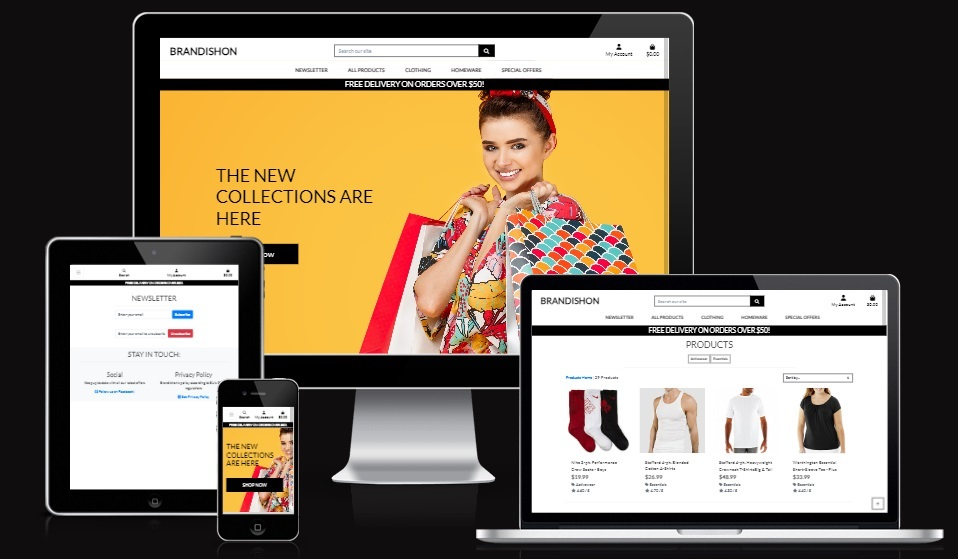

## Features

### Existing Features

- **Navigation Bar**
  
  - Featured on all pages. Includes a searchbar for products, links to logo (sends user to homepage), Newsletter, All Products, Clothing, Homeware, Special Offers, My Account, Shopping bag and is the same on each page for easy navigation.
  - Below are the features accessible by the 'My Account' link.
    - My Account (anonymous user): (Login, Register)
    - My Account (registered user): (My Profile, My Wishlist, Logout)
    - My Account (site admin): (anonymous user): (Product Management, My Profile, My Wishlist, Logout)

  - It also includes a bar that mentions free shipping on orders over $50!

  - 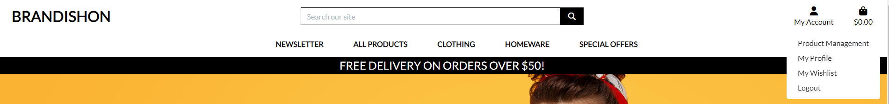

- **Footer**
  
  - Featured on all pages. Link to social media page (facebook) and a privacy policy according to GDPR
  - 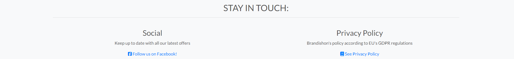

- **Homepage**

  - The homepage is the first page the user will encounter. It shows a smiling woman with several shopping bags, a text to captivate the customer with the promise of 'new collections', and a button the user can click on, the 'SHOP NOW' which will take them to the products page.

- **Newsletter**

The newsletter is built to be easy and simple with minimum interface, yet also safe. The user can quickly subscribe to receive mails from Brandishon, without the necessity of having to register for an account.

  - Shows two fields: Subscribe and Unsubscribe. For straightforward, minimum work and good user experience to quickly and easily subscribe or unsubscribe to Brandishon's newsletter.
  - Subscribe field: Includes a form where any user (logged in or not) can enter their email address if they want to subscribe to Brandishon's newsletter. When their email is entered, a verification email is sent to the user to verify that the email wants to subscribe to the newsletter. Clicking the verification link will allow the users to receive the newsletter.
  - Unsubscribe field: Includes a form where any user (logged in or not) can enteir their email address if they want to unsubscribe to Brandishon's newsletter. When their email is entered, a verification email is sent to the user to verify that the email wants to unsubscribe to the newsletter. Clicking the verification link will allow the users to stop receiving the newsletter and this data will be removed from the database.

- **The Products Page**

Quick overview:
  - The products page contains all products. The products page can be categorized and filtered to show, pricing, sorts, ratings and many more options for the user to quickly access desired content.
  - It is accessible by the following:
    - Navbar: Search our site (the search bar), ALL PRODUCTS (all dropdown elements), CLOTHING (all dropdown elements), HOMEWARE (all dropdown elements), SPECIAL OFFERS (all dropdown elements)
    - Homepage: 'SHOP NOW' button.
  - Clicking on any product will take the user to the detailed page of the product

More details:

The products page is sortable and categorizable.

  - Sorting: The products page can show all products or be specifically sorted.
  - Sorting by price, rating and category is accessible in the navbar under 'ALL PRODUCTS' and choosing (By Price, By Rating, By Category, All Products). This feature is also present in a sorting function on the products page itself. In which the user can sort prices, ratings (from low to high and reverse) and name, category (from a to z and reverse)

  - Categorization: The products page can show categorized products, filtering results the user wants to access.
  - Categorization is possible in the navbar under 'CLOTHING' and choosing (Activewear & Essentials, Jeans, Shirts, All Clothing), under 'HOMEWARE' and choosing (Bed & Bath, Kitchen & Dining, All Homeware), under 'SPECIAL OFFERS' and choosing (New Arrivals, Deals, Clearance, All Specials)

  - 

- **Product Detail Page**

  - Wishlist Button
    - Users can easily add products to their wishlist for future reference. It will show up in 'My Wishlist' page under 'My Account' if they are logged in.
  - Admin Product Management
    - Administrators have the capability to delete or edit products directly from the product detail page.
  - Quantity Selection and Add to Bag
    - Users can conveniently choose the quantity of desired products and seamlessly add them to their shopping bag.
  - Continue Shopping
    - Allows users to continue browsing after adding products to their bag, ensuring a smooth shopping experience.
  - User Reviews
    - Logged-in users can contribute reviews for products they've purchased, enhancing the community engagement and providing valuable feedback.
  - Guest Checkout
    - Users have the option to make purchases without the need to create an account, streamlining the checkout process and accommodating guest users.

- **Shopping bag**

The Shopping Bag feature provides users with a seamless experience to manage their selected items before proceeding to checkout. Here's an overview of its functionalities:

  - Empty Bag Notification: If the shopping bag is empty, users are presented with a message stating "Your bag is empty" along with a "Keep Shopping" button, encouraging them to continue browsing.

  - Adding Items: Products added from the detailed product page are dynamically reflected in the shopping bag, ensuring a real-time update of selected items.

  - Item Management: Users can easily update the quantity or size of items directly within the shopping bag interface. Additionally, they have the option to remove items they no longer wish to purchase.

  - Cost Information: Each item's cost and the total cost of all items are clearly displayed, providing users with transparency regarding their shopping expenses.

  - Checkout Navigation: If there are items in the shopping bag, users are presented with a prominent "Secure Checkout" button, facilitating a smooth transition to the checkout process. Alternatively, they can choose to continue shopping.

This comprehensive feature set ensures that users can efficiently manage their shopping selections, review costs, and proceed to checkout securely when ready.

- **Checkout**

The Checkout section facilitates the final steps of the purchasing process, ensuring a seamless and secure transaction experience for users.

  - Order Information: Users proceed to the Checkout page from the Shopping Bag by clicking on the "Secure Checkout" button. Required Fields below.
    - Name
    - Email
    - Phone Number
    - Street Address
    - Town/City
    - Country (Selection Required)
    - Card Number (Processed securely through the Stripe payment system)

  - Profile Integration: If users have filled in their information in the My Profile section, relevant details are automatically populated in the Checkout form. Users are presented with an option to save their delivery information to their profile for future convenience.

  - Finalizing the Order: Upon completing all required fields, users have two options.
    - Adjust Bag: Allows users to return to the Shopping Bag to edit their order.
    - Complete Order: Initiates the transaction process.

  - Transaction Confirmation: Upon initiating the transaction, a loading screen indicates the processing of the order. Once the transaction is completed, users receive a thank-you message confirming the successful transaction. They will receive a order confirmation email to the provided email address, where they can see the details. The order details are also displayed both on the webpage itself. The order information is also accessible under the "My Profile" section for logged-in users.

  - Return to Shopping: After completing the transaction, users are prompted with a button labeled "NOW CHECK OUT THE LATEST DEALS!". Clicking this button redirects users to the Products page, where they can explore categories such as "Clearance", "Deals", and "New Arrivals".

- **Register, Login and Logout**

  - Allows the user to register and make an account. The authentication functionalities are powered using Django's allauth package.
    - **Register:** Users can create an account by registering through the provided registration form.
    - **Login:** Registered users can log in using their credentials via the login form.
    - **Logout:** Allows logged-in users to sign out securely from their accounts.
    - 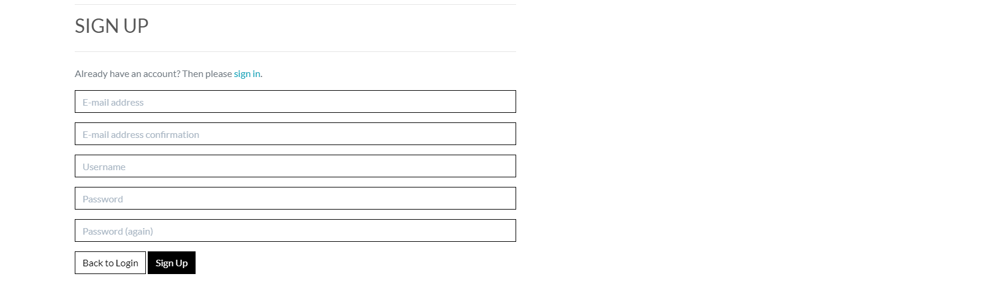

- **Product Management (Must be logged in as admin)**

Overview
  - This feature provides administrators with the ability to manage products within the e-commerce platform. It requires users to be logged in as admin to access these functionalities.

  -  Add New Product
    - Admins have the privilege to add new products to the platform by providing essential product details:
      - Category selection: Choose the appropriate category for the product.
      - SKU: Type in the Stock Keeping Unit (SKU) for the product.
      - Product Name: Enter the name of the product.
      - Description: Provide a detailed description of the product.
      - Size (if applicable): Specify the available sizes for the product.
      - Price: Set the price for the product.
      - Rating: Optionally assign a rating to the product.
      - Image Upload: Upload an image representing the product.
  - Action Buttons
    - Upon adding product details, admins have two action buttons to choose from:
      - Add Product: Finalizes the addition of the product to the platform.
      - Cancel Action: Allows admins to discard the current action and return to the products page.

- **My Profile (Must be logged in)**

The My Profile section provides users with a personalized space where they can manage their account details, view their order history, and update their information.

  - Profile Management: Users can access a dedicated page to save and update their personal information, ensuring a seamless shopping experience. This information includes shipping address, contact details, and preferences.

  - Order History: Users have the ability to view their complete order history, allowing them to track past purchases and review details such as order dates, items purchased, and order statuses. This feature enhances transparency and accountability in the shopping process.

  - Information Update: Users can easily update their profile information, such as shipping address, email, and password, ensuring accuracy and relevance of their account details. This feature contributes to a user-friendly experience, allowing users to maintain up-to-date information effortlessly.

  - 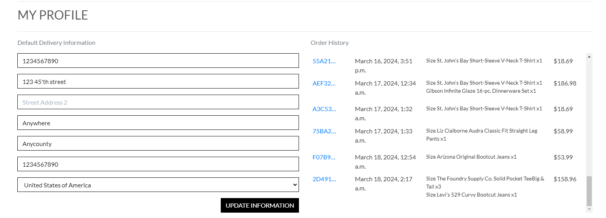

- **My Wishlist (Must be logged in)**

  - Adding Items to Wishlist: Users can click on the "Add to Wishlist" button while viewing the detailed page of a product. This action adds the selected product to their wishlist for future reference.

  - Accessing Wishlist Items: Users can easily access their wishlist by navigating to the designated section within the application. Clicking on an item in the wishlist will direct users to the detailed page of the specified product, facilitating seamless browsing and purchase decisions.

  - Removing Items from Wishlist: If a product is already present in the user's wishlist, the "Add to Wishlist" button will be replaced with a "Remove from Wishlist" option. Clicking on this button removes the item from the wishlist, allowing users to manage their selections effortlessly.

### Features Left to Implement

- Truncate blog posters name and commenter (in post details).
  - **Reasons**: Lack of time.

- Insert ability for users to write their bios on profile page without having to access django admin panel.
  - **Reasons**: Lack of time.

- Blog posts and comments made by a user to show up on their profile page.
  - **Reasons**: Lack of current knowledge and time.

- Implement like system for blog posts and see amount of likes. Allowing users to give positive feedback to posts.
  - **Reasons**: Lack of time.

## User Experience - UX

The design and functionalities of the website is based around user stories and the agile methodology.
Since the work is based of Boutique Ado, using it as a template. The original UX is kept to that.

### User Stories

The user stories are accessible in the Musician's Blog User Stories project
<https://github.com/Masorr/brandishon/projects?query=is%3Aopen>

- Epic: Viewing and Navigation
  - #1 As a shopper I can view a list of products so that I can select some to purchase
  - #2 As a shopper I can view individual product details so that I can identify price, product rating, image and available sizes
  - #3 As a shopper I can identify deals clearance items and special offers so that I can take advantage of special savings on products I'd like to purchase
  - #5 As a shopper I can view the total of my purchase so that I can avoid spending too much

- Epic: Sorting and Searching
  - #10 As a shopper I can sort list of available products so that I can identify the best rated, best priced and categorically sorted products
  - #11 As a shopper I can sort a specific category of product so that I can find the best priced or best rated product in a specific category or sort the products in that category by name
  - #26 As a shopper I can view specific category of product so that I can find products im interested in without having to search through all products
  - #12 As a shopper I can sort multiple categories of products simultaneously so that I can find the best priced or best rated products across broad categories such as clothing or homeware
  - #14 As a shopper I can easily see what I've searched for and the number of results so that I can quickly decide whether the product I want is available
  - #13 As a shopper I can search for a product by name or description so that I can find a specific product I'd like to purchase
  - #25 (Unfinished) As a shopper I can view the most bought products so that I can view which products are the most popular

- Epic: Purchasing and Checkout
  - #15 As a shopper I can select size and quantity of a product so that I don't order wrong size or quantity
  - #16 As a shopper I can view items in my bag to be purchased so that I can identify the total cost of my purchase and all items I will receive
  - #17 As a shopper I can adjust the quantity of individual items in my bag so that I can easily make changes to my purschase before checkout
  - #18 As a shopper I can easily enter my payment information so that I can check out quickly and with no hassles
  - #19 As a shopper I can view an order confirmation after checkout so that I can verify that I haven't made any mistakes
  - #20 As a shopper I can receive an email confirmation after checking out so that I can keep the confirmation of what I've purchased for my records

- Epic: Admin and Store Management
  - #21 As a store owner I can add, edit/update, delete a product so that I can add new items to my store, change produce prices, descriptions, images and other product criteria and remove items that are no longer for sale

- Epic: Registration and User Accounts
  - #4 As a site user I can easily register for an account so that I have a personal account and is able to view my profile
  - #6 As a site user I can easily log in and out so that I can access my personal account information
  - #7 As a site user I can recover my password so that I can recover access to my account
  - #8 As a site user I can receive an email confirmation after registering so that I can verify my account registration was successful
  - #9 As a site user I can have a personalized user profile so that I can view my personal order history, order confrimations and save my payment information
  - #24 As a site user/shopper I can add products to my wishlist so that I can keep track of my personal items and be informed of special offers

- Epic: Reviews and Wishlist
  - #23 As a shopper I can view reviews a bought product so that I can assure the quality of the product
  - #22 As a shopper I can review a bought product so that I can assure the quality of the product to other shoppers and the owner
  - #27 (Unfinished) As a site user/shopper I can get informed by mail and site-notifications about updates on my wishlist items so that I can be informed of special offers and product updates

## Design

- Since Brandishon is based off Code Institute's Boutique Ado e-commerce project. The design retains this style.
- Only wireframes available are for the new additions. Three of which are the review function for product detail page, wishlist page and the newsletter page.
- The ERDS show already established models in the CodeStar blog as well as new.
- The new models here are: **Reviews**, **Wishlist**, **Newsletter**

## Marketing

## Privacy Policy

- **Wireframes**

  - 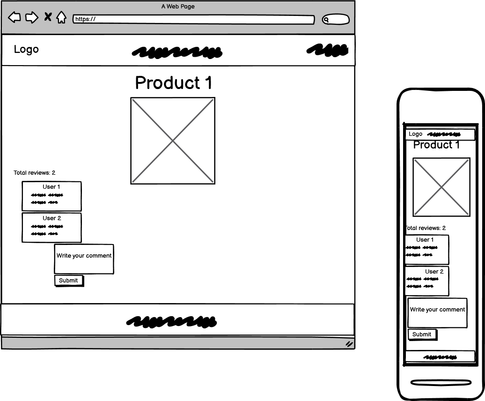
  - 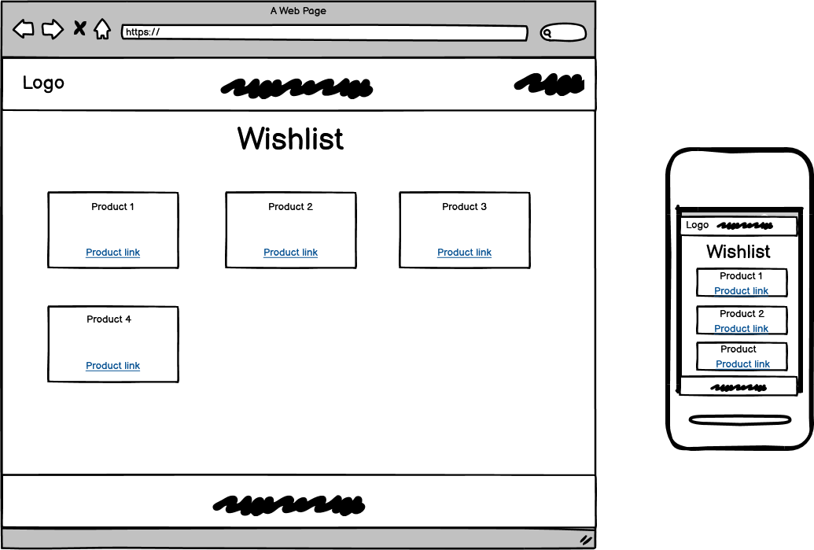
  - 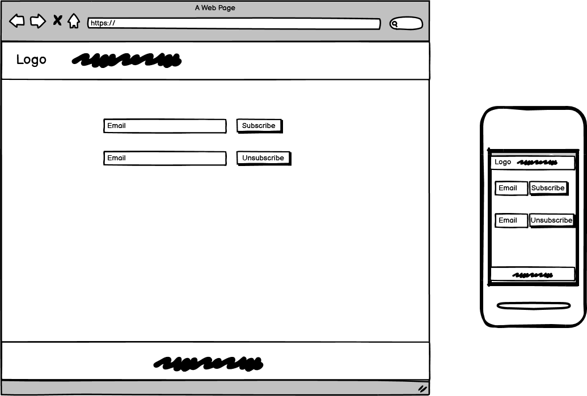

- **ERD (Entity Relationship Diagrams)**

  - 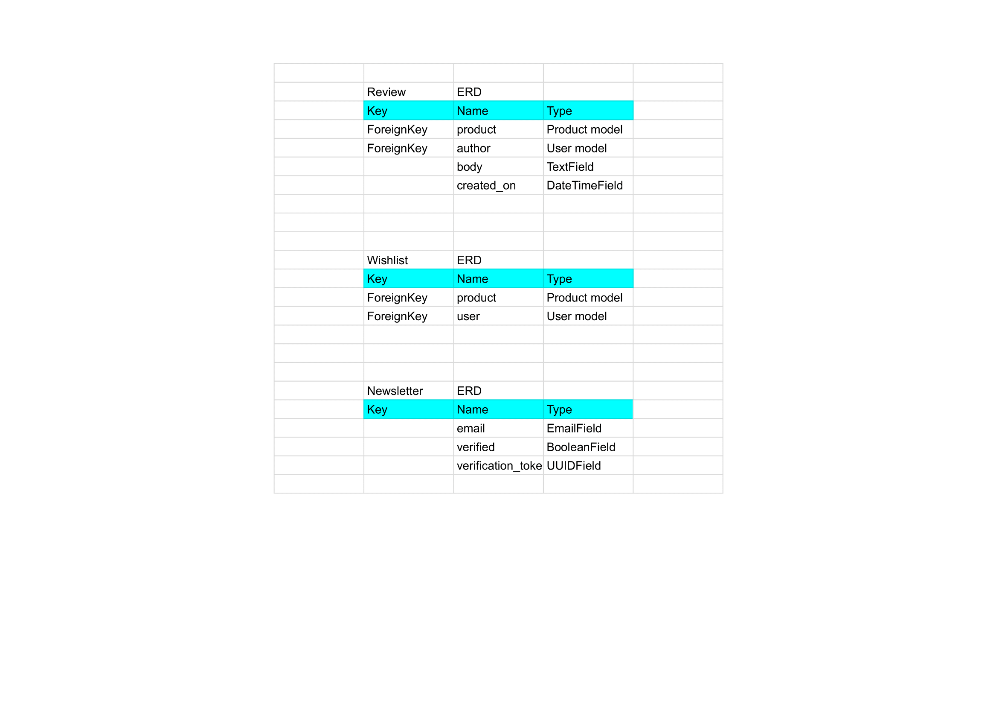

- **Colours**

  - There are mainly 4 prevalent colour types.
  - White (most common). Mostly used as background.
  - Black (common). For text and buttons.
  - Grey (uncommon). Used mostly for borders.
  - Yellow (rare). Used only on home page.

## Testing

### Manual Testing

There have been extensive manual testing of the site.
Testing of every major feature both on site and in django admin panel.
Below is a list of specific manual tests.

### Validator Testing

Since the project is quite extensive and considering that this project is using Code Institute's Boutique Ado as template.
The CSS, JavaScript and Python validations have been tailored towards the programmers own extensions. HTML validation was run on all pages on the deployed project.

For quick Python code refactoring through the whole project, autopep8 was run. Files intentionally avoided were settings.py and migration files
python3 -m flake8
autopep8 --in-place --aggressive --aggressive <file name>

- HTML
  - No errors were found when passing through the W3C HTML validator: <https://validator.w3.org/>
  - Below is the example return result of the 'all products page' (the most code-crammed page on Brandishon) with nearly 8000 lines of html code

- W3C HTML validator results for HTML pages.

  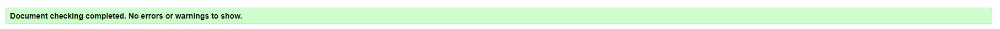
  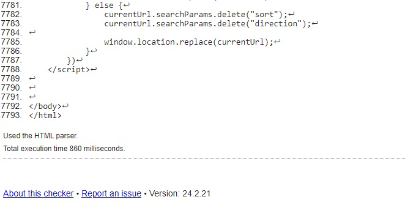

- CSS
  - No errors or warnings were found when passing through the W3C CSS validator: <https://jigsaw.w3.org/css-validator/>

- W3C CSS validator result for style.css.

  

- JavaScript
  - No errors were found when passing through the JSHint validator: <https://jshint.com/>

- JSHint validator result for javascript file comments.js

  

- Python
  - No errors or warnings were found when passing through the PEP8 python validator: <https://pep8ci.herokuapp.com/>

- PEP8 validator result for python files in Brandishon's reviews, wishlist and newsletter additions.

  

### Media

- Tested on Microsoft Edge, Mozilla Firefox and Chrome.
- Screen media mockup tested on <https://ui.dev/amiresponsive?url=https://brandishon-ab5cf39e8610.herokuapp.com/>
- Tested on desktop, laptop and mobile.

### Lighthouse Testing

- Home page
  - 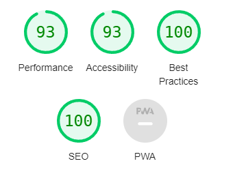
- Post detail page
  - 
- About page
  - 
- Register / Login / Logout
  - The coder chose to group the lighthouse for these together.
  - The one which performed worst was taken, which was sign up page.
  - 
- Profiles
  - 
- Profile
  - 
- My profile
  - 

### Fixed Bugs

-

### Unfixed Bugs

- There are no known unfixed bugs.

## Deployment

- The site was deployed to Heroku:
  - Create a new Heroku app.
  - Add config var for amazon web services: 'AWS_ACCESS_KEY_ID' and value: 'your access key'
  - Add config var for amazon web services: 'AWS_SECRET_ACCESS_KEY' and value: 'your secret key'
  - Add config var for database: 'DATABASE_URL' and value: 'your postgres database url'.
  - Add config var for email: 'EMAIL_HOST_PASS' and value: 'your app password'
  - Add config var for email: 'EMAIL_HOST_USER' and value: 'your mail'
  - Add config var for secret key: 'SECRET_KEY' and value: 'your secret key'.
  - Add config var for stripe: 'STRIPE_PUBLIC_KEY' and value: 'your public key'
  - Add config var for stripe: 'STRIPE_SECRET_KEY' and value: 'your secret key'
  - Add config var for stripe's webhook: 'STRIPE_WH_SECRET' and value: 'your secret webhook key'
  - Add config var for amazon web services: 'USE_AWS' and value: 'True'

  - Go to deploy, select deployment method (GitHub).
  - Search for 'brandishon' in app to connect to GitHub and connect the repository to Heroku.
  - Hit 'deploy branch' at bottom of page.
  - Select 'Open app' at the top of the page.

Link to live site - <https://brandishon-ab5cf39e8610.herokuapp.com/>

- Cloning the Repository:
  - On the repository page, click the 'Code' box.
  - Pick local then HTTPS and copy the link that is shown, which is: <https://github.com/Masorr/musicians_blog.git>
  - Open the terminal in your code editor and specify the directory you want to have your clone.
  - Type 'git clone' into your terminal and paste the link <https://github.com/Masorr/musicians_blog.git> and hit enter.

## Disclaimer

## Credits

### Content

- The base of the e-commerce Django project comes from Code Institute's Boutique Ado walkthrough project. This is most of the functionality of the website. Including home page, products page, detailed products page, shopping bag, checkout function. Login functionality and registering of users and the stripe payment handling.

### Media

- All images were taken from Boutique Ado's walkthrough project.

## Thanks

- I want to thank Code Institute and their tutors for their program and lessons, and giving me the opportunity to learn by myself by coding this full stack blog website using the django framework.
- I want to thank the Slack community and my mentor Dick Vlaanderen for feedback and inputs.